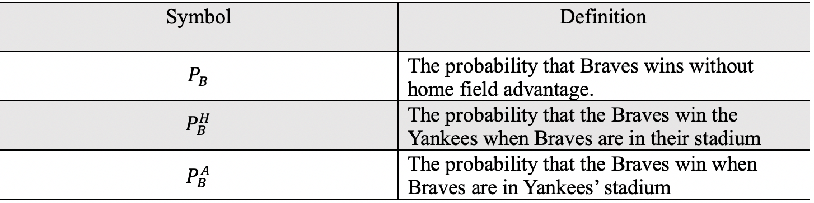
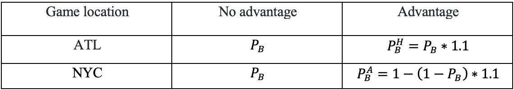

#  Introduction
The World Series is a first-to-4-wins match-up between the champions of the American and National Leagues of Major League Baseball. The home field advantage is when one team has a game in their own home stadium, they can have a higher probability of winning the game.In this blog, we analyze two team whose names are Braves and Yankees. Braves's home stadium is Atlanta and Yankees's home stadium is New York City(NYC = New York City, ATL = Atlanta). 

# Notations
 {width=600px}

 {width=600px}


# Solutions to questions

## Question 1

The following code chunk is to solve the probability that the Braves win the world series when the sequence of game locations is {NYC, NYC, ATL, ATL, ATL, NYC, NYC}. As the question shows, when Braves are in their own stadium or not, their the probability of winning the world series. By the chunk below, we need to discovery  the situation that what probability of winning is.


```{r}
#Q1_with_homeadvantage
require(dplyr)
require(data.table)
# Get all possible outcomes
apo <- fread("all-possible-world-series-outcomes.csv")

# Home field indicator
hfi <-  c(0,0,1,1,1,0,0) #{NYC, NYC, ATL, ATL, ATL, NYC, NYC}

# P_B
pb <- 0.55
advantage_multiplier <- 1.1 # Set = 1 for no advantage
pbh <- 0.55*advantage_multiplier # have advantage
pba <- 1 - (1 - 0.55)*advantage_multiplier #no

# Calculate the probability of each possible outcome
apo[, p := NA_real_] # Initialize new column in apo to store prob
for(i in 1:nrow(apo)){
  prob_game <- rep(1, 7)
  for(j in 1:7){
    p_win <- ifelse(hfi[j], pbh, pba)
    prob_game[j] <- case_when(
        apo[i,j,with=FALSE] == "W" ~ p_win
      , apo[i,j,with=FALSE] == "L" ~ 1 - p_win
      , TRUE ~ 1
    )
  }
  apo[i, p := prod(prob_game)] # Data.table syntax
}

# Sanity check: does sum(p) == 1?
#apo[, sum(p)] # This is data.table notation

# Probability of overall World Series outcomes
apo[, sum(p), overall_outcome]
```
```{r}
#Q1_without_homeadvantage
require(dplyr)
require(data.table)
# Get all possible outcomes
apo <- fread("all-possible-world-series-outcomes.csv")


# P_B
p_win<- 0.55
#advantage_multiplier <- 1.1 # Set = 1 for no advantage
#pbh <- 0.55*advantage_multiplier
#pba <- 1 - (1 - 0.55)*advantage_multiplier

# Calculate the probability of each possible outcome
apo[, p := NA_real_] # Initialize new column in apo to store prob
for(i in 1:nrow(apo)){
  prob_game <- rep(1, 7)
  for(j in 1:7){
    #p_win <- ifelse(hfi[j], pbh, pba)
    prob_game[j] <- case_when(
        apo[i,j,with=FALSE] == "W" ~ p_win
      , apo[i,j,with=FALSE] == "L" ~ 1 - p_win
      , TRUE ~ 1
    )
  }
  apo[i, p := prod(prob_game)] # Data.table syntax
}

# Sanity check: does sum(p) == 1?
#apo[, sum(p)] # This is data.table notation

# Probability of overall World Series outcomes
apo[, sum(p), overall_outcome]
```
Answer: The difference in probabilites (with vs without home field advantage) does depend on the advantage factor. The conclusion comes from the answer of question 1. Through comparing with home field advantage result with without home field advantage result, the first result's probability of overall World Series outcomes that Braves can win is 0.604221. Otherwise, the second's probability of overall World Series outcomes that Braves can win is 0.6082878. The two values are different. The difference in probabilities is 0.0040668.

## Question 2

For real situation, the probability that Braves win is nearly not possible to be constantly equal to 0.55. Thus we use Binomial Distribution to produce the probability that Braves win in computer.

```{r}
#Q2_with_homeadvantage

require(dplyr)
require(data.table)
# Get all possible outcomes
apo <- fread("all-possible-world-series-outcomes.csv")

# Home field indicator
hfi <-  c(0,0,1,1,1,0,0) #{NYC, NYC, ATL, ATL, ATL, NYC, NYC}

# P_B
pb <- mean(rbinom(10000,1000,0.55)/1000)
advantage_multiplier <- 1.1 # Set = 1 for no advantage
pbh <- mean(rbinom(10000,1000,0.55)/1000)*advantage_multiplier
pba <- 1 - (1 - mean(rbinom(10000,1000,0.55)/1000))*advantage_multiplier

# Calculate the probability of each possible outcome
apo[, p := NA_real_] # Initialize new column in apo to store prob
for(i in 1:nrow(apo)){
  prob_game <- rep(1, 7)
  for(j in 1:7){
    p_win <- ifelse(hfi[j], pbh, pba)
    prob_game[j] <- case_when(
        apo[i,j,with=FALSE] == "W" ~ p_win
      , apo[i,j,with=FALSE] == "L" ~ 1 - p_win
      , TRUE ~ 1
    )
  }
  apo[i, p := prod(prob_game)] # Data.table syntax
}

# Sanity check: does sum(p) == 1?
#apo[, sum(p)] # This is data.table notation

# Probability of overall World Series outcomes
apo[, sum(p), overall_outcome]
```

```{r}
#Q2_without_homeadvantage
require(dplyr)
require(data.table)
# Get all possible outcomes
apo <- fread("all-possible-world-series-outcomes.csv")

# Home field indicator

# P_B
p_win<- mean(rbinom(10000,1000,0.55)/1000)
#advantage_multiplier <- 1.1 # Set = 1 for no advantage
#pbh <- 0.55*advantage_multiplier
#pba <- 1 - (1 - 0.55)*advantage_multiplier

# Calculate the probability of each possible outcome
apo[, p := NA_real_] # Initialize new column in apo to store prob
for(i in 1:nrow(apo)){
  prob_game <- rep(1, 7)
  for(j in 1:7){
    #p_win <- ifelse(hfi[j], pbh, pba)
    prob_game[j] <- case_when(
        apo[i,j,with=FALSE] == "W" ~ p_win
      , apo[i,j,with=FALSE] == "L" ~ 1 - p_win
      , TRUE ~ 1
    )
  }
  apo[i, p := prod(prob_game)] # Data.table syntax
}

# Sanity check: does sum(p) == 1?
#apo[, sum(p)] # This is data.table notation

# Probability of overall World Series outcomes
apo[, sum(p), overall_outcome]
```
The stadium's probability of overall World Series outcomes that Braves can win is 0.6039864. Otherwise, the without home field' probability of overall World Series outcomes that Braves can win is 0.6088088.From computer simulation, we see that the values of simulation are basically equel to the corresponding probability.

## Question 3
From question 1 and question 2, we can know that the probabilities of Braves win are basically equal no matter whether you have a home advantage or not. But is it ture? In order to solve this worry. We introduced the relative error and absolute error. By calculating, the the absolute and relative error for your simulation in the previous question are 0.0001244 and 0.0005190909 respectively.

```{r}
#Q3
p_win3<-0.55
absolute_error_assign4<-abs(p_win3-mean(rbinom(10000,1000,0.55)/1000))
absolute_error_assign4

relative_error_assign4<-abs(p_win3-mean(rbinom(10000,1000,0.55)/1000))/p_win3
relative_error_assign4
```

## Question 4
Because previous questions all are based on PB=0.55, it lets me consider when PB changes, does it produce difference in probabilites? In this point, we set PB unknown. Then we repeat same calculation process.
```{r}

#Q4_with_homeadvantage
require(dplyr)
require(data.table)
# Get all possible outcomes
apo <- fread("all-possible-world-series-outcomes.csv")

# Home field indicator
hfi <-  c(0,0,1,1,1,0,0) #{NYC, NYC, ATL, ATL, ATL, NYC, NYC}

# P_B
pb_win<-rep(NA,100)
pb_vector<-rep(NA,100)
for (l in 1:100){
  pb_win[l]<-0.01*l

advantage_multiplier <- 1.1 # Set = 1 for no advantage
pbh <- pb_win[l]*advantage_multiplier
pba <- 1 - (1 - pb_win[l])*advantage_multiplier

# Calculate the probability of each possible outcome
apo[, p := NA_real_] # Initialize new column in apo to store prob
for(i in 1:nrow(apo)){
  prob_game <- rep(1, 7)
  for(j in 1:7){
    p_win4 <- ifelse(hfi[j], pbh, pba)
    prob_game[j] <- case_when(
        apo[i,j,with=FALSE] == "W" ~ p_win4
      , apo[i,j,with=FALSE] == "L" ~ 1 - p_win4
      , TRUE ~ 1
    )
  }
  apo[i, p := prod(prob_game)] # Data.table syntax
}

# Sanity check: does sum(p) == 1?
#apo[, sum(p)] # This is data.table notation

# Probability of overall World Series outcomes
d<-apo[, sum(p), overall_outcome]
pb_vector[l]<-d[[1,2]]

}


#Q4_without_homeadvantage
require(dplyr)
require(data.table)
# Get all possible outcomes
apo <- fread("all-possible-world-series-outcomes.csv")

# Home field indicator
#hfi <- c(1,1,0,0,0,1,1) #{NYC, NYC, ATL, ATL, ATL, NYC, NYC}

pb_win_without<-rep(NA,100)
pb_vector_without<-rep(NA,100)
for (l in 1:100){
  pb_win_without[l]<-0.01*l
  
# Calculate the probability of each possible outcome
apo[, p := NA_real_] # Initialize new column in apo to store prob
for(i in 1:nrow(apo)){
  prob_game <- rep(1, 7)
  for(j in 1:7){
    #p_win <- ifelse(hfi[j], pbh, pba)
    prob_game[j] <- case_when(
        apo[i,j,with=FALSE] == "W" ~ pb_win_without[l]
      , apo[i,j,with=FALSE] == "L" ~ 1 - pb_win_without[l]
      , TRUE ~ 1
    )
  }
  apo[i, p := prod(prob_game)] # Data.table syntax
}

# Sanity check: does sum(p) == 1?
#apo[, sum(p)] # This is data.table notation

# Probability of overall World Series outcomes
d_without<-apo[, sum(p), overall_outcome]
pb_vector_without[l]<-d_without[[1,2]]

}
```


```{r}
pb_difference<-rep(NA,100)
for(i in 1:100){
pb_difference[i]<-pb_vector[i]-pb_vector_without[i]
}
v<-seq(0.01,1,by=0.01)
plot(x=v,y=pb_difference,type="l",xlab = "PB",ylab = "The difference in probabilities")
```

### Figure analysis for question 4
The difference in probability's values are from subtracting the probabilities that Braves win in their stadium from the probabilities that Braves win in Yankees's stadium. At the same time, when the values of PB is changing, we observe the difference in probabilities. By looking the graph, when the value PB is approaching 0.38, the difference in probability reached the minimum. And  the difference in probability has maximum value given that PB is close to 0.70.


## Question 5
If we change the value of advantage_multiplier, we can find what change of the difference in probabilites is. To discovery this point, we set the difference in probabilites as y label and advantage_multiplier as x label to draw a graph.

```{r}
#Q5_with_homeadvantage
require(dplyr)
require(data.table)
# Get all possible outcomes
apo <- fread("all-possible-world-series-outcomes.csv")

# Home field indicator
hfi <-  c(0,0,1,1,1,0,0) #{NYC, NYC, ATL, ATL, ATL, NYC, NYC}

# P_B
advantage_multiplier<-rep(NA,100)
pb_vector_5<-rep(NA,100)
for (l in 1:100){
 advantage_multiplier_C[l]<-1+l*0.01


pbh <- 0.55*advantage_multiplier_C[l]
pba <- 1 - (1 - 0.55)*advantage_multiplier_C[l]

# Calculate the probability of each possible outcome
apo[, p := NA_real_] # Initialize new column in apo to store prob
for(i in 1:nrow(apo)){
  prob_game <- rep(1, 7)
  for(j in 1:7){
    p_win <- ifelse(hfi[j], pbh, pba)
    prob_game[j] <- case_when(
        apo[i,j,with=FALSE] == "W" ~ p_win
      , apo[i,j,with=FALSE] == "L" ~ 1 - p_win
      , TRUE ~ 1
    )
  }
  apo[i, p := prod(prob_game)] # Data.table syntax
}

# Sanity check: does sum(p) == 1?
#apo[, sum(p)] # This is data.table notation

# Probability of overall World Series outcomes
d<-apo[, sum(p), overall_outcome]
pb_vector_5[l]<-d[[1,2]]

}


```


```{r}
#Q5
pb_difference_5<-rep(NA,100)
pb_vector_without<-0.6082878
for(i in 1:100){
pb_difference_5[i]<-pb_vector_5[i]-pb_vector_without
}
v<-seq(0.01,1,by=0.01)
plot(x=v,y=pb_difference_5,type="l",ylab="The difference in probabilities",xlab="Advantage multiplier")
```

### Figure analysis for question 5
By observing the graph, I found that with the advantage multiplier growth, the difference in probabilities is becoming more distinct.

# Conclusions
In a word, when PB is changing, the difference in probabilitiies is also changing. And when PB is 0.5, the difference in probabilities are close to 0. Moreover, by increasing advantage multiplier, it will enlarge the difference in probabilities. Above all, when one team has home field advantage, it does have an impact on helping that team win game.
